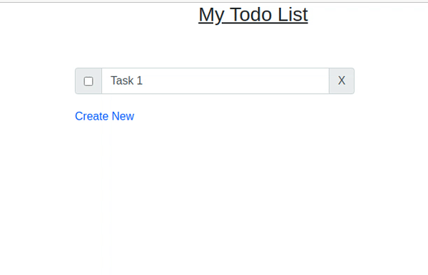

# Vue.js ToDo Frontend

This project demonstrates a simple frontend application developed with Vue.js. In this project, we will
consume [RESTful](https://restfulapi.net/) API prepared in the 
[Spring Boot ToDo Backend](https://github.com/tareq403/SpringBoot-ToDo-Backend) project.
We shall prepare a simple list view to show the list of todos, prepare a create view to add new todo entry and
an edit view to modify an existing todo. We shall be using Vue router to navigate between the views.

## Before you start
You will need to have [npm](https://www.npmjs.com/) and [Vue CLI](https://cli.vuejs.org/) installed in your
system. To install Vue CLI you can run the following command:
```
npm install -g @vue/cli
```

## Initiating the project
Create a project directory. Go to the project directory in terminal and run the following command:
```
vue create .
```
You will get prompt for the project directory and project presets. At this moment, you can answer "yes" in both
cases.
Vue CLI will now initiate your project. It may take some time. After the project is initiated, the directory
structure will be like this:
```
├── README.md
├── babel.config.js
├── node_modules
├── package-lock.json
├── package.json
├── public
│   ├── favicon.ico
│   └── index.html
└── src
    ├── App.vue
    ├── assets
    │   └── logo.png
    ├── components
    │   └── HelloWorld.vue
    └── main.js
```

## Installing the dependencies
Go to the `package.json` file. You will find a `dependencies` property something like this:
```
{
  ...
  "dependencies": {
    "core-js": "^3.6.4",
    "vue": "^2.6.11"
  },
  ...
}
```
We shall add the following dependencies to our project:

1. [Vue Router](https://router.vuejs.org/): To enable navigation between different components.
2. [BootstrapVue](https://bootstrap-vue.org/): A Vue compatible bootstrap framework.
3. [Axios](https://github.com/axios/axios): To enable rest API calls.
4. [Sass Loader](https://webpack.js.org/loaders/sass-loader/): To compile SASS to CSS.

After adding these dependencies, our `dependencies` property will look like this:
```
{
  ...
  "dependencies": {
    "axios": "^0.19.2",
    "bootstrap": "^4.5.0",
    "bootstrap-vue": "^2.15.0",
    "core-js": "^3.6.4",
    "vue": "^2.6.11",
    "vue-router": "^3.3.4"
  },
  ...
}
```
Now run the following command to install all the dependencies:
```
npm install
```

## Preparing the components
For this project, we shall create three components:
1. `ListToDo`: to show all the Todo entries in a list view.
2. `CreateToDo`: to create a new Todo instance.
3. `EditToDo`: to modify an existing Todo instance.

We shall create these components under `src/components/` directory. There is an alredy created component file
called `HelloWord.vue`. We are not going to use it, so you can delete this file.

To navigate between the components, we will need to prepare a router file.

### Preparing the router
The router file is located at the `src/routers/index.js`. In the router file, we shall declare three routes,
each for one of the components we discussed above.

Here is the full code of the router file:
```js
import Router from "vue-router";
import ListToDo from "../components/ListToDo";
import CreateToDo from "../components/CreateToDo";
import EditToDo from "../components/EditToDo";

export default new Router({
    routes: [
        {
            path: "/",
            name: "ListToDo",
            component: ListToDo
        },
        {
            path: "/create",
            name: "CreateToDo",
            component: CreateToDo
        },
        {
            path: "/update/:id",
            name: "EditToDo",
            component: EditToDo
        }
    ]
});
```

### Component: src/components/**ListToDo.vue**
In the `ListToDo` component, we shall display all the ToDo entries in a list view. There will be option 
(a checkbox) to mark a ToDo item as _done_ and there will be option
(x button) to delete a ToDo item. By clicking on the list item, user will be able to navigate to the edit
view.

Here is the code for the `ListToDo.vue` component:

```vue
<template>
    <div v-show="toDos.length>0" class="col align-self-center">
        <h3 class="pb-5 text-center underline">My Todo List</h3>
        <div class="form-row align-items-center" v-for="toDo in toDos" v-bind:key="toDo.id">
            <div class="col-auto my-1">
                <div class="input-group mb-3 todo_row">
                    <div class="input-group-prepend">
                        <span class="input-group-text">
                            <input
                                    type="checkbox"
                                    v-model="toDo.done"
                                    :checked="toDo.done"
                                    :value="toDo.done"
                                    v-on:change="updateToDo(toDo)"
                                    title="Mark as done?"
                            />
                        </span>
                    </div>
                    <input
                            type="text"
                            class="form-control"
                            :class="toDo.done?'todo_done':''"
                            v-model="toDo.name"
                            @click="toDo.done?'':editToDo(toDo)"
                            @keypress="toDo.editing=true"
                            @keyup.enter="updateToDo(toDo)"
                    />
                    <div class="input-group-append">
                        <div class="input-group-text">
                            <span
                                    class="input-group-addon addon-left"
                                    title="Delete Todo?"
                                    v-on:click="deleteToDo(toDo.id)"
                            >
                                X
                            </span>
                        </div>
                    </div>
                </div>
            </div>
        </div>
        <router-link to="/create">Create New</router-link>
    </div>
</template>

<script>
    export default {
        name: "ListToDo",
        data() {
            return {
                toDos: [],
                doneLoading: false
            }
        },
        created: function () {
            this.fetchToDo();
        },
        watch: {
            $route: function () {
                let self = this;
                self.doneLoading = false;
                self.fetchToDo().then(() => {
                    self.doneLoading = true;
                })
            }
        },
        methods: {
            fetchToDo() {
                this.$http.get("/").then(response => {
                    this.toDos = response.data;
                })
            },
            editToDo(todo) {
                let id = todo.id;
                this.$router.push({name: "EditToDo", params: {id: id}});
            },
            updateToDo(todo) {
                let id = todo.id;
                this.$http.put(`/${id}`, todo).then(response => {
                    console.log(response);
                }).catch(error => {
                    console.log(error);
                })
            },
            deleteToDo(id) {
                this.$http.delete(`/${id}`).then(() => {
                    this.fetchToDo();
                }).catch(error => {
                    console.log(error);
                })
            }
        }
    }
</script>

<style lang="scss" scoped>
    .todo_done {
        text-decoration: line-through !important;
    }

    .no_border_left_right {
        border-left: 0px;
        border-right: 0px;
    }

    .flat_form {
        border-radius: 0px;
    }

    .mrb-10 {
        margin-bottom: 10px;
    }

    .addon-left {
        background-color: none !important;
        border-left: 0px !important;
        cursor: pointer !important;
    }

    .addon-right {
        background-color: none !important;
        border-right: 0px !important;
    }

    .underline {
        text-decoration: underline;
    }
</style>
```

### Component: src/components/**CreateToDo.vue**
In the `CreateToDo` component, there will be a form to create a new ToDo item. A new ToDo item will be 
created upon the submission of the form and user will be navigated to the list view.

Here is the full code of the `CreateToDo.vue` component:
```vue
<template>
    <div class="col align-self-center">
        <h3 class="pb-5 text-center underline">Create new Todo</h3>
        <form class="sign-in" @submit.prevent>
            <div class="form-group todo_row">
                <input
                        type="text"
                        class="form-control"
                        placeholder="Title"
                        v-model="name"
                />
                <textarea
                        class="form-control"
                        placeholder="Details"
                        v-model="details"
                ></textarea>
                <input
                    type="submit"
                    class="btn btn-primary"
                    value="Save Todo"
                    @click="addToDo()"
                />
            </div>
        </form>
    </div>
</template>

<script>
    export default {
        name: "CreateToDo",
        data() {
            return {
                name: "",
                details: ""
            }
        },
        methods: {
            addToDo() {
                let todo = {
                    name: this.name,
                    "details": this.details,
                    done: false
                };
                this.$http
                    .post("/", todo)
                    .then(() => {
                        this.goToList();
                    })
                    .catch(error => {
                        console.log(error);
                    });
            },
            goToList() {
                this.$router.push({name: "ListToDo"});
            }
        }
    }
</script>

<style lang="scss" scoped>
    .underline {
        text-decoration: underline;
    }
</style>
```

### Component: src/components/**EditToDo.vue**
When the user clicks on a ToDo item in the list view, the user is navigated to the edit view.
In the `EditToDo` component, there will be a form prepopulated with the ToDo item to modify it. 
The ToDo item is updated upon the submission of the form and user will be navigated to the list view.

Here is the full code of the `EditToDo.vue` component:
```vue
<template>
    <div class="col align-self-center">
        <h3 class="pb-5 text-center underline">Update Todo</h3>
        <form class="sign-in" @submit.prevent>
            <div class="form-group todo_row">
                <input
                        type="text"
                        class="form-control"
                        placeholder="Title"
                        v-model="name"
                />
                <textarea
                        class="form-control"
                        placeholder="Details"
                        v-model="details"
                ></textarea>
                <input
                        type="submit"
                        class="btn btn-primary"
                        value="Save Todo"
                        @click="updateToDo()"
                />
            </div>
        </form>
    </div>
</template>

<script>
    export default {
        name: "EditToDo",
        data() {
            return {
                id: "",
                name: "Loading...",
                details: "Loading...",
                done: false,
                doneLoading: false
            }
        },
        mounted() {
            console.log("Edit mounted.")
            this.id = this.$route.params.id;
            console.log("Id found: " + this.id);
            this.fetchToDo(this.id);
        },
        methods: {
            fetchToDo(id) {
                this.$http
                    .get(`/${id}`)
                    .then(response => {
                        this.name = response.data.name;
                        this.details = response.data.details;
                        this.done = response.data.done;
                        this.doneLoading = true;
                    })
            },
            updateToDo() {
                if (!this.doneLoading) {
                    return;
                }
                let todo = {
                    name: this.name,
                    details: this.details,
                    done: false
                };
                let id = this.id;
                this.$http
                    .put(`/${id}`, todo)
                    .then(() => {
                        this.goToList();
                    })
                    .catch(error => {
                        console.log(error);
                    });
            },
            goToList() {
                this.$router.push({name: "ListToDo"});
            }
        }
    }
</script>

<style lang="scss" scoped>
    .underline {
        text-decoration: underline;
    }
</style>
```

## Loading the components in the App.vue
We declare the root component in the `App.vue` component file. Here we load a router view, which will load
the appropriate component based on the router.

Here is the full code of the `App.vue` file:
```vue
<template>
    <div class="container" id="app">
        <div class="row vertical-center justify-content-center mt-50">
            <div class="col-md-6 mx-auto">
                <router-view/>
            </div>
        </div>
    </div>
</template>

<script>
    export default {
        name: 'App',
    }
</script>

<style lang="scss">
    @import "node_modules/bootstrap/scss/bootstrap";
    @import "node_modules/bootstrap-vue/src/index.scss";

    .vertical-center {
        min-height: 100%;
        display: flex;
        align-items: center;
    }

    .todo_row {
        width: 400px;
    }

    .form-control {
        margin-bottom: 10px;
    }
</style>
```

## Declaring the configs
We dedicate `config.js` file for declaring the configurations of the project. For this project, we declare
the `BASE_URL` for the rest API endpoint. You can set the value based on your setup.

```js
const Config = {
    BASE_URL: "http://localhost:8070/todo"
};

export default Config;
```

## Wrapping it all up in the **main.js**
The `main.js` file is the entry point of the application. We load everything from this point.

Here is the content of this file:
```js
import Vue from 'vue'
import Router from "vue-router"
import BootstrapVue from "bootstrap-vue";
import axios from "axios";
import App from './App.vue';
import Config from "./config";
import router from "./routers";

const http = axios.create({
  baseURL: Config.BASE_URL
})

Vue.prototype.$http = http;
Vue.use(Router);
Vue.use(BootstrapVue);
Vue.config.productionTip = false;

new Vue({
  render: h => h(App),
  router
}).$mount('#app')
```

### Running the project
Run the following command in the terminal to run the project:
```
npm run build
```

This is the result:


